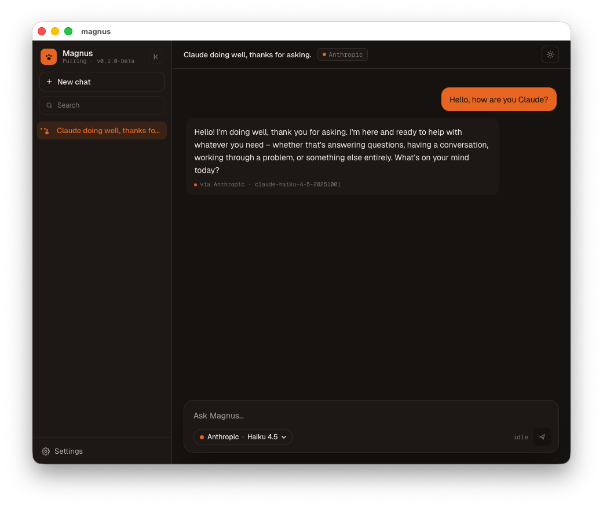
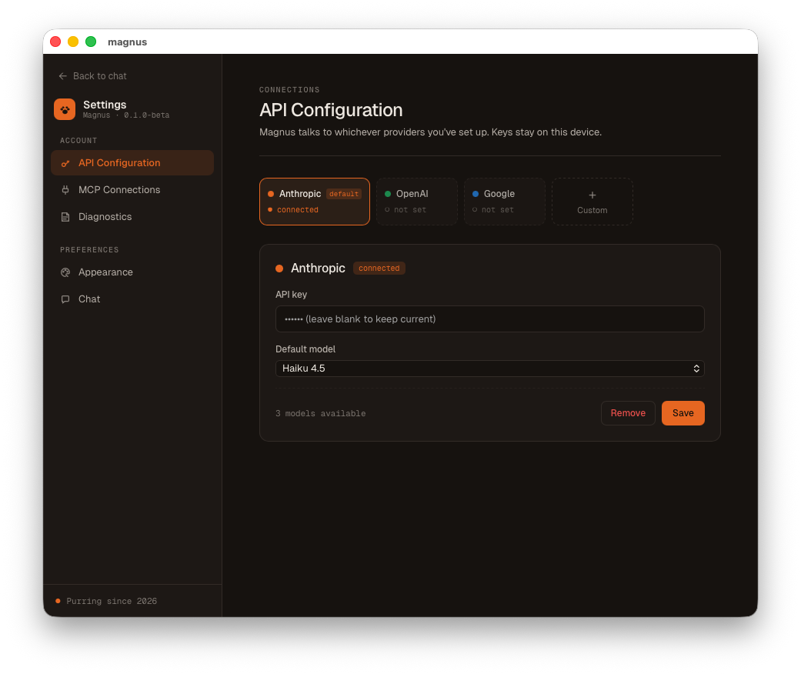
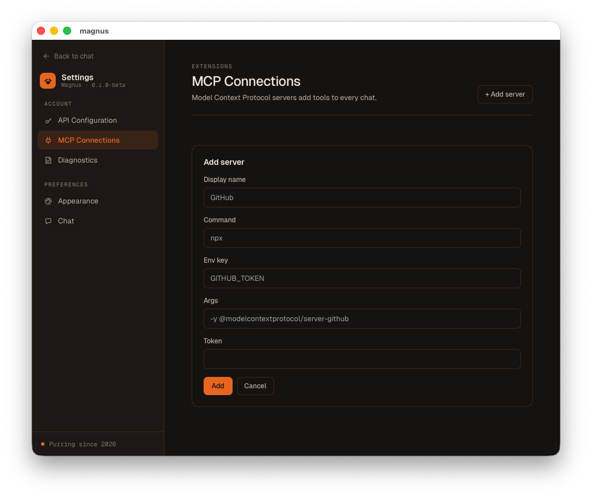
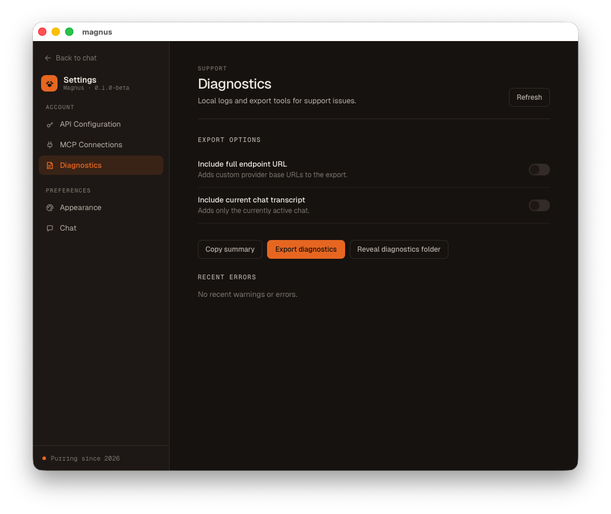

# Magnus

Welcome to Magnus! An open-source desktop application to run your favorite chat bots, agents, and MCPs. Magnus' style is inspired
in my cat, Manug (See picture below). As you can see, he is an orange tabby, a playful, loving but demanding cat. He loves playing,
eating and speding time with their favorite humans.


It is built with Tauri, Rust, React, and TypeScript as a lightweight native alternative to Electron-based AI desktop apps.

Magnus is aimed at developers and early adopters who want more control over how desktop AI tooling connects to built-in providers, custom LLM gateways, self-hosted endpoints, and local tool servers.



## What Magnus Does

- Runs persisted AI Chats with independent Chat Transcripts.
- Supports built-in and Custom Providers.
- Supports Anthropic, OpenAI, and Google Provider Protocols.
- Stores Provider API Keys in the System Secret Store instead of App Data.
- Lets Chats use a selected Provider and Model for the next User Message.
- Connects to configured MCP Servers and exposes MCP Tools at runtime.
- Captures Diagnostic Events and creates redacted Diagnostics Exports.
- Keeps provider calls in the Rust backend; the React frontend is only the UI layer.

### Connect your favorite LLMS (WIP), even your own proxy


### Connect your favorite MCPs



## Current Status

Magnus is pre-release software. The current app has Chats, Provider Settings, Provider API Key storage, Custom Providers, MCP Server configuration, and Diagnostics.

Planned or incomplete areas include:

- Agent Studio, Agent Workflows, and Agent Loops.
- System Instructions.
- MCP auto-connect on startup.
- Blocked Chats when a deleted Provider is still referenced by an existing Chat.
- Signed and notarized release artifacts.
- Broader test coverage before stable releases.

## Install

### GitHub Releases

For preview builds, download the latest artifact from the project Releases page:

https://github.com/stoicastronaut/magnus/releases

Release artifacts are built for Linux, Windows, macOS Apple Silicon, and macOS Intel when a version tag is published.

macOS preview builds are currently unsigned and not notarized. macOS may show a security warning on first launch. Use right-click -> Open, or build from source if you prefer to inspect and run the app locally. Do not disable Gatekeeper globally.

### Build From Source

Requirements:

- Rust `1.92.0`
- Node.js 22
- pnpm `10.25.0`
- Tauri system dependencies for your operating system

Clone the repository:

```bash
git clone git@github.com:stoicastronaut/magnus.git
cd magnus
```

Install frontend dependencies:

```bash
pnpm install --frozen-lockfile
```

Run the app in development:

```bash
cargo tauri dev
```

Build a production bundle:

```bash
cargo tauri build
```

## Development

Useful checks:

```bash
pnpm tsc --noEmit
pnpm lint
pnpm test
cargo fmt --manifest-path backend/Cargo.toml -- --check
cargo clippy --manifest-path backend/Cargo.toml -- -D warnings
cargo test --manifest-path backend/Cargo.toml
```

Coverage checks are available, but the current project is below the target threshold:

```bash
pnpm test:coverage
cargo llvm-cov --manifest-path backend/Cargo.toml --lib --fail-under-lines 90
```

## How to Report a Bug

Before opening a bug report, check whether the issue already exists in GitHub Issues.

When filing a bug, include:

- What you were trying to do.
- What happened.
- What you expected to happen.
- Your operating system and Magnus version.
- The Provider and Provider Protocol involved, if relevant.
- The downloadable `.tar.gz` file created by Settings -> Diagnostics -> Export diagnostics, when it helps explain the issue.

The Diagnostics section can also copy a short summary and reveal the exported file after it is created.

Do not include Provider API Keys, private endpoint URLs, real Chat Transcripts, or unredacted Diagnostics Exports in public issues. Only enable optional Diagnostics export fields when they are needed for the bug report.


For suspected vulnerabilities, secret leakage, unsafe diagnostics exports, or System Secret Store problems, do not file a public issue. Follow the security reporting guidance in `CONTRIBUTING.md`.

## Architecture

Magnus uses Tauri v2 with a Rust backend and React frontend.

- Frontend code lives in `frontend/` and communicates with Rust through Tauri Commands.
- Backend code lives in `backend/src/` and owns provider calls, persistence, diagnostics, MCP connections, and secret access.
- Provider API calls go through Rust using `reqwest`; the frontend never calls Provider APIs directly.
- Non-secret settings and Chats are stored in App Data.
- Provider API Keys are stored separately in the System Secret Store.

For domain language, see `CONTEXT.md`. For architecture decisions, see `docs/adr/`.

## Contributing

Contributions are welcome. See `CONTRIBUTING.md` for the contribution process, local checks, and security reporting guidance.

## License

Magnus is released under the MIT License. See `LICENSE`.
